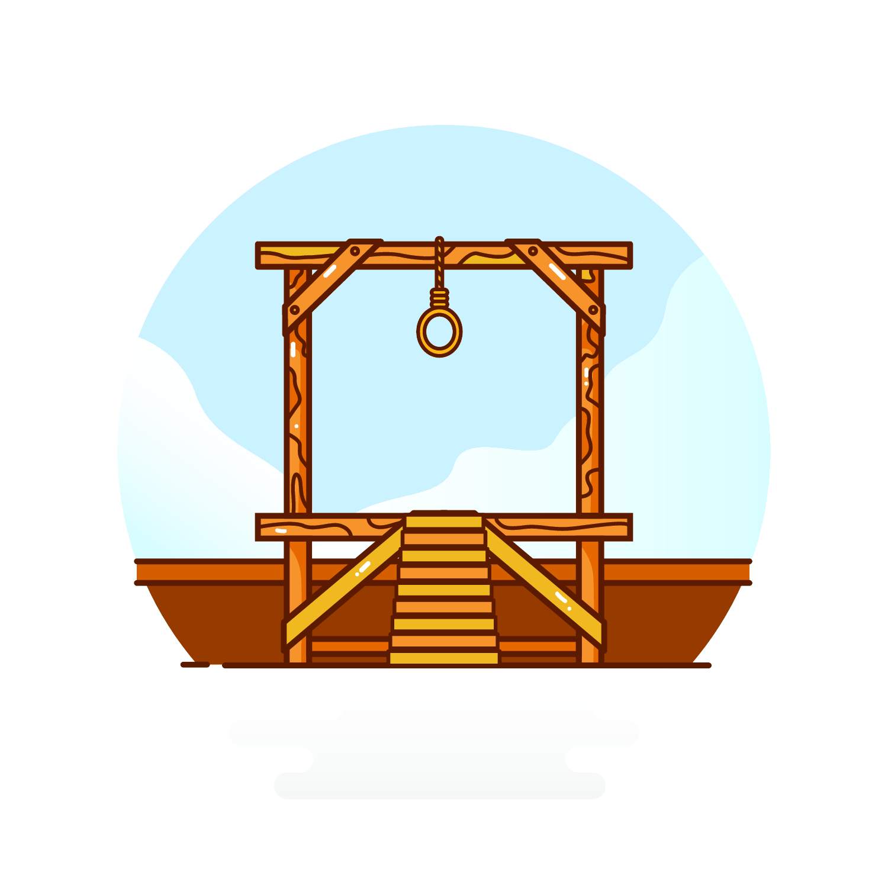
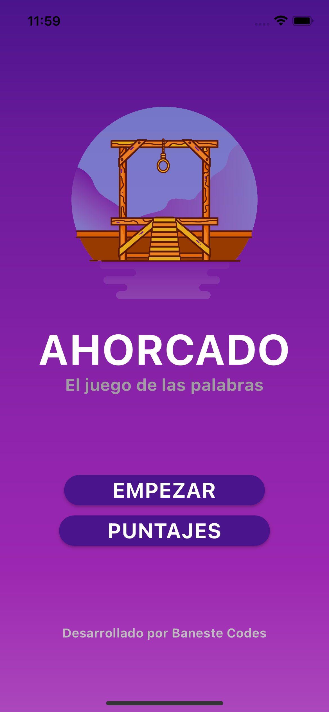
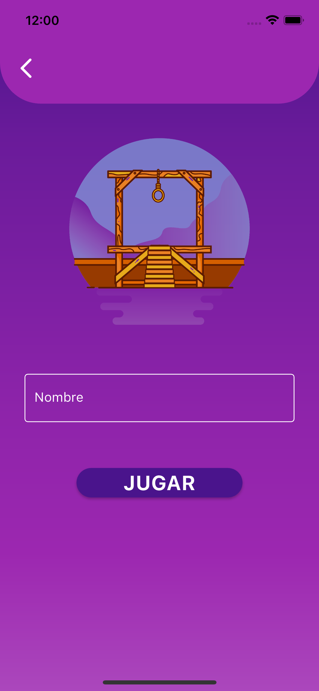
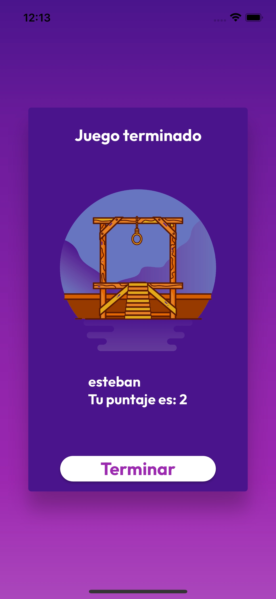
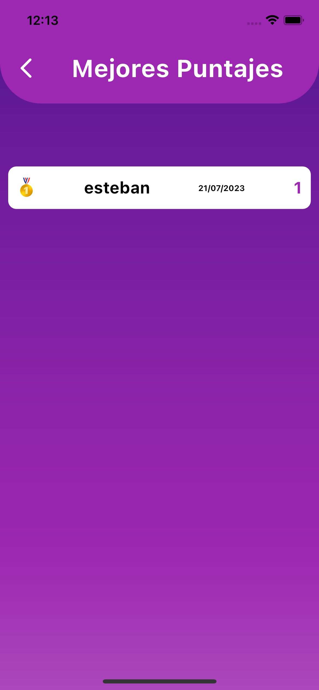

## Flutter Ahorcado

Un juego del ahorcado escrito en Dart con marco Flutter manejando el gestor de estado de Bloc. El jugador tiene 3 vidas en cada turno. Los puntajes anteriores se pueden ver en la página de puntajes altos.





## Development Setup
Clone the repository and run the following commands:
```
flutter pub get
flutter run
```
